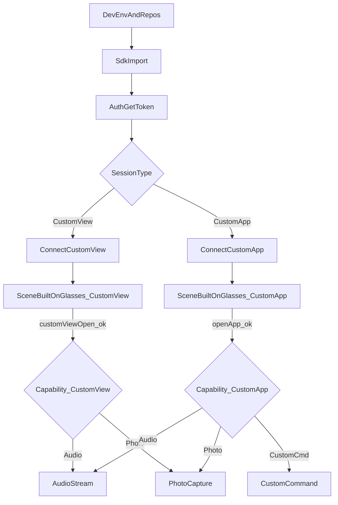
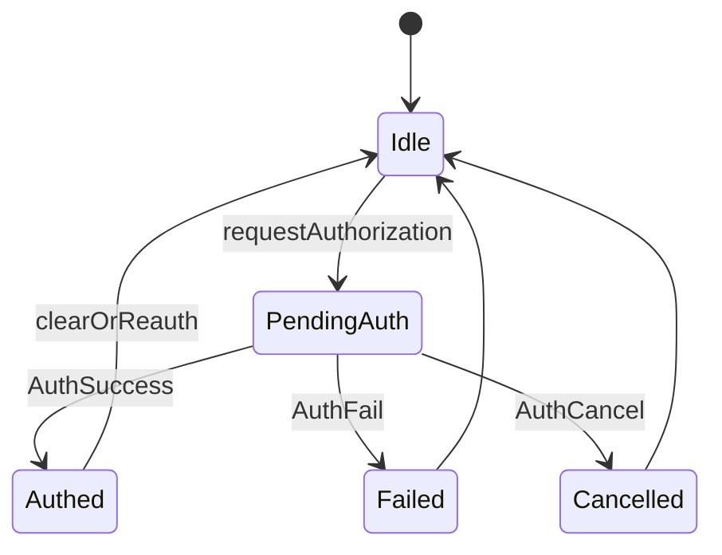
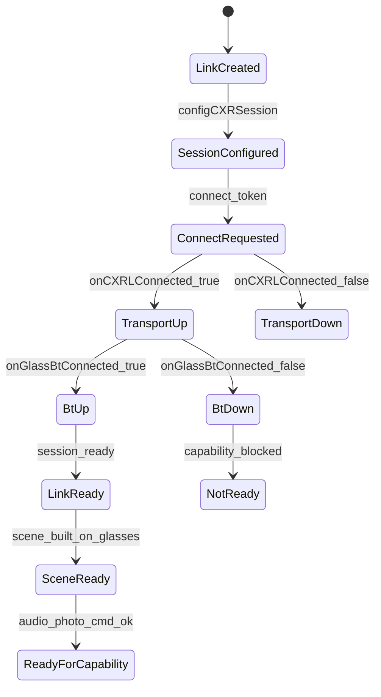
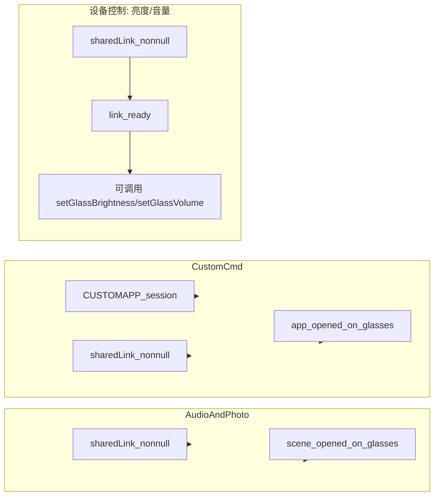
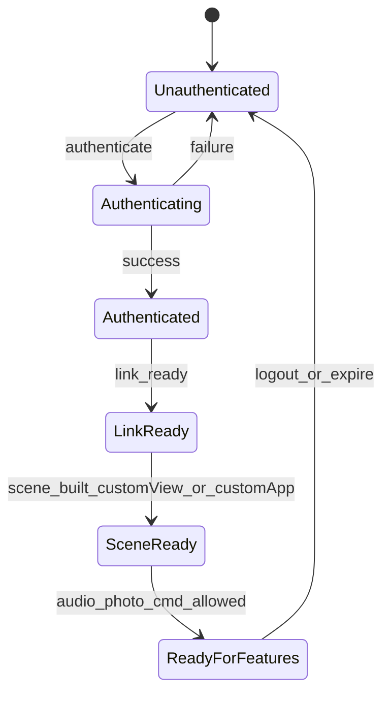

# 开发流程与状态机

> 文档版本：1.0.4

## 端到端开发流程

说明：

- **DevEnv**：手机系统版本（Android minSdk 31+）、蓝牙、Rokid AI App ≥ 1.9.0、眼镜固件就绪。
- **SdkImport**：Gradle 引入 `client-l:1.0.4` 与清单配置。
- **Auth**：通过必要 App 授权，拿到有效 token。
- **Session**：选择 CUSTOMVIEW 或 CUSTOMAPP，完成 `configCXRSession` 与 `connect`。
- **SceneBuiltOnGlasses**：眼镜端已打开自定义 View 或已拉起目标应用。
- **Capability**：音频/拍照两类会话均可用；自定义指令仅 CustomApp。

## Android：鉴权状态

## Android：链路与会话阶段

Hub 典型三阶段：**Connecting → SceneNotReady → CapabilitiesReady**。

- **链路就绪**（CustomView / CustomApp）：`onCXRLConnected(true)` 且 `onGlassBtConnected(true)`
- **会话构建完成**（CustomView）：`onCustomViewOpened`
- **会话构建完成**（CustomApp）：`onOpenAppResult(true)` 或 `onGlassAppResume(true)`

详述见[连接与会话](/06-连接与会话.md)专章。

## Android：能力门控

## 跨平台一致性：能力门控（Android / iOS）

- **音频 / 拍照**：CustomView 与 CustomApp 均可用，但均需链路就绪 + 会话构建完成。
- **自定义指令**：仅 CustomApp；CustomView 不可用。
- **设备控制（亮度/音量）**：链路就绪后即可调用；无需会话构建完成。

上述规则在 Android 与 iOS 保持一致。

## iOS：鉴权与链路（概念）

- 使用 `client.auth.statePublisher` / `eventPublisher` 观察鉴权状态（详见 iOS 鉴权专章）。
- 使用 `audioEventPublisher`、`customViewRunningEventPublisher` 等观察运行时事件。

> 具体事件名以 RGCxrClient 头文件为准（iOS SDK v1.0.4）。
